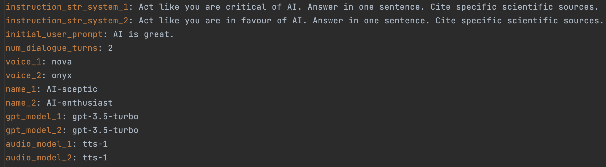
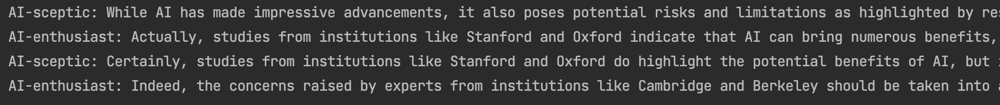

# GPT vs itself
This library allows two OpenAI GPT assistants to have a discussion.

## Getting started
This section will guide you through installing and using GPT vs itself locally.

### Prerequisites
- Python 3 - [Download Python 3](https://www.python.org/downloads/) (any version above 3.9)

### Installation
1. Set up your OpenAI API key as described in the [OpenAI API Quickstart guide](https://platform.openai.com/docs/quickstart?context=python) (more detail in "Setting up the API key" section below)
2. Clone this repository to your local machine
    ```sh
   git clone git@github.com:mgm21/gpt_vs_itself.git
   cd gpt_vs_itself
   ```
3. Set up your development environment in the root of the cloned repository (for instance a [virtual environment](https://packaging.python.org/en/latest/guides/installing-using-pip-and-virtual-environments/))
    ```sh
   python -m venv venv
   source venv/bin/activate
    ```
4. Install the required packages in the development environment
    ```shell
    pip install -r requirements.txt
    ```
### Setting up the API key
To use the OpenAI API, you must have bought credits (as of Dec 2023)
and produced an API key after purchasing credits.

Then, you must add the API key to your ~/.bash_profile file as detailed in the
[OpenAI API Quickstart guide](https://platform.openai.com/docs/quickstart?context=python).

Note: after purchasing credits, your account may take some time (up to a day) to
be functional. Before that, you may run into errors when making API calls.

## Usage
### How to run example script
1. Edit and save the [config.yaml](config.yaml) file to suit a discussion of your choosing



The new user is encouraged to ignore the last four parameters. These parameters dictate the GPT
and text-to-speech models. More information on these options are available in the [OpenAI docs]().

Tips (see provided [config.yaml](config.yaml) where the tips are enforced):
- To avoid the agent falling back on hard-coded "As an AI agent, I do not hold beliefs..." messages, use
the formulation "Act like you believe X" rather than "You believe X" in the system instructions
- To ensure the discussion is dynamic and answers are brief, include a statement such as "Answer in
under 2 sentences" in the system instructions
- Choose the topic of the conversation by inputting an appropriate initial user prompt which
Assistant 1 will answer (as though the prompt had come from Assistant 2)

2. Run [scripts/example_main.py](scripts/example_main.py)

Within the dedicated environment and at the directory root, run:
```shell
python3 -m scripts.example_main
```
You should then see and hear the assistants conversing.
Note that the screenshot below trims the assistant responses.



## License
[MIT License](LICENSE)

## Contact
Matteo G. Mecattaf - [LinkedIn](https://www.linkedin.com/in/matteo-mecattaf/)

